# Architecture Overview

This document describes the architecture of the GenAI Golden Path platform, showing how Backstage, GitLab, ArgoCD, and Google Cloud work together to provide a self-service developer experience.

## Table of Contents

- [High-Level Architecture](#high-level-architecture)
- [Component Flow](#component-flow)
- [Sequence Diagram](#sequence-diagram)
- [Permission Model](#permission-model)
- [Technology Stack](#technology-stack)

## High-Level Architecture

The platform follows a **GitOps** pattern where:
1. Developers interact with Backstage UI (self-service portal)
2. Backstage generates code and pushes to GitLab (source of truth)
3. ArgoCD syncs GitLab to Kubernetes (continuous deployment)
4. Config Connector creates GCP resources (infrastructure as code)

```mermaid
flowchart TB
    subgraph User["👤 Developer Experience"]
        U[Developer] --> |"1. Fills form"| BSU[Backstage UI]
        BSU --> |"Selects template"| TPL[GenAI Golden Path Template]
    end

    subgraph Backstage["🎭 Backstage Platform"]
        TPL --> |"2. Scaffolder processes"| SCF[Scaffolder Engine]
        SCF --> |"Replaces placeholders"| VAL["Template Values<br/>• component_id<br/>• gcp_project_id<br/>• owner"]
        VAL --> |"3. Generates files"| GEN["Generated Files<br/>├── infra/<br/>│   ├── iam.yaml<br/>│   ├── storage.yaml<br/>│   └── vertex.yaml<br/>├── src/<br/>│   └── app.py<br/>├── Dockerfile<br/>└── catalog-info.yaml"]
    end

    subgraph GitLab["🦊 GitLab"]
        GEN --> |"4. publish:gitlab action"| REPO[New Repository]
        REPO --> |"Contains"| INFRA["infra/*.yaml<br/>(KRM Manifests)"]
        REPO --> |"Contains"| SRC["src/<br/>(Application Code)"]
        REPO --> |"Contains"| CAT["catalog-info.yaml"]
    end

    subgraph ArgoCDSystem["🔄 ArgoCD"]
        REPO -.-> |"5. Watches repo"| ARGO[ArgoCD Controller]
        ARGO --> |"6. Detects changes"| SYNC[Sync Process]
        SYNC --> |"7. Applies manifests"| APPLY["kubectl apply"]
    end

    subgraph GKE["☸️ GKE Autopilot Cluster"]
        APPLY --> |"8. Creates CRDs"| CC[Config Connector]

        subgraph ConfigConnector["Config Connector Resources"]
            CC --> IAM_SA["IAMServiceAccount<br/>genai-project-sa"]
            CC --> BUCKET["StorageBucket<br/>genai-project-data"]
            CC --> SVC["Service<br/>aiplatform.googleapis.com"]
            CC --> IAM_POL1["IAMPolicyMember<br/>storage-access"]
            CC --> IAM_POL2["IAMPolicyMember<br/>vertex-access"]
        end

        subgraph WorkloadIdentity["🔐 Workload Identity"]
            CC_SA["Config Connector SA<br/>(K8s)"] --> |"Impersonates"| GCP_SA["config-connector-sa<br/>(GCP)"]
        end
    end

    subgraph GCP["☁️ Google Cloud Platform"]
        subgraph IAM["IAM"]
            GCP_SA --> |"9. Creates"| SA_REAL["Service Account<br/>genai-project-sa@project.iam"]
            SA_REAL --> |"Granted"| ROLE1["roles/storage.objectUser"]
            SA_REAL --> |"Granted"| ROLE2["roles/aiplatform.user"]
        end

        subgraph Storage["Cloud Storage"]
            BUCKET --> |"10. Creates"| GCS["GCS Bucket<br/>genai-project-data"]
        end

        subgraph VertexAI["Vertex AI"]
            SVC --> |"11. Enables"| API["aiplatform.googleapis.com"]
        end
    end

    subgraph Catalog["📚 Backstage Catalog"]
        CAT --> |"12. catalog:register"| REG[Register Component]
        REG --> |"Appears in"| CATALOG["Service Catalog<br/>• Component view<br/>• Resource dependencies<br/>• GCP Console links"]
    end

    classDef user fill:#e1f5fe,stroke:#01579b
    classDef backstage fill:#fff3e0,stroke:#e65100
    classDef gitlab fill:#fce4ec,stroke:#880e4f
    classDef argocd fill:#f3e5f5,stroke:#4a148c
    classDef gke fill:#e8f5e9,stroke:#1b5e20
    classDef gcp fill:#e3f2fd,stroke:#0d47a1
    classDef catalog fill:#fff8e1,stroke:#ff6f00

    class U,BSU,TPL user
    class SCF,VAL,GEN backstage
    class REPO,INFRA,SRC,CAT gitlab
    class ARGO,SYNC,APPLY argocd
    class CC,IAM_SA,BUCKET,SVC,IAM_POL1,IAM_POL2,CC_SA,GCP_SA gke
    class SA_REAL,ROLE1,ROLE2,GCS,API gcp
    class REG,CATALOG catalog
```

## Component Flow

### Step-by-Step Breakdown

| Step | Component | Action | Output |
|------|-----------|--------|--------|
| 1 | Developer | Fills Backstage form | Form data (component_id, project, etc.) |
| 2 | Scaffolder | Processes template | Replaces `${{ values.* }}` placeholders |
| 3 | Scaffolder | Generates files | Complete project structure |
| 4 | GitLab Action | Creates repository | New repo with all files |
| 5 | ArgoCD | Watches repository | Detects new/changed files |
| 6 | ArgoCD | Syncs to cluster | Applies Kubernetes manifests |
| 7 | Config Connector | Reconciles CRDs | Creates GCP API requests |
| 8-11 | GCP | Provisions resources | SA, Bucket, API, IAM bindings |
| 12 | Catalog | Registers component | Visible in Backstage UI |

## Sequence Diagram

This diagram shows the temporal flow of events from developer action to resource creation:

## Permission Model

Config Connector uses **Workload Identity** to authenticate with GCP without managing service account keys.

### Workload Identity Flow

### Required IAM Roles

| Role | Purpose | Used By |
|------|---------|---------|
| `roles/storage.admin` | Create and manage GCS buckets | StorageBucket CR |
| `roles/aiplatform.admin` | Manage Vertex AI resources | Service CR |
| `roles/serviceusage.serviceUsageAdmin` | Enable/disable GCP APIs | Service CR |
| `roles/iam.serviceAccountAdmin` | Create service accounts | IAMServiceAccount CR |
| `roles/resourcemanager.projectIamAdmin` | Manage project IAM policies | IAMPolicyMember CR |

### Template to Permission Mapping

## Technology Stack

### Core Components

| Component | Technology | Purpose |
|-----------|------------|---------|
| Developer Portal | Backstage | Self-service UI, software catalog |
| Source Control | GitLab | Git repository, CI/CD pipelines |
| GitOps Controller | ArgoCD | Continuous deployment, sync management |
| Kubernetes | GKE Autopilot | Container orchestration, managed nodes |
| Infrastructure as Code | Config Connector | GCP resource management via K8s CRDs |
| Cloud Provider | Google Cloud | Compute, storage, AI/ML services |

### Data Flow Summary

## Key Design Decisions

### Why GitOps?

1. **Single Source of Truth**: All configuration lives in Git
2. **Audit Trail**: Every change is a commit with author and timestamp
3. **Rollback**: Easy to revert to any previous state
4. **Security**: No direct access to production clusters needed

### Why Config Connector?

1. **Kubernetes-Native**: Manage GCP resources using familiar `kubectl` commands
2. **Declarative**: Define desired state, let the system reconcile
3. **Unified Tooling**: Same workflow for app deployments and infrastructure
4. **Drift Detection**: Automatically corrects manual changes in GCP

### Why Workload Identity?

1. **No Key Management**: No service account keys to rotate or secure
2. **Least Privilege**: Fine-grained permissions per workload
3. **Automatic Rotation**: Credentials are short-lived and auto-refreshed
4. **Audit Logging**: All API calls are traceable to specific pods

## Next Steps

- [Prerequisites](01-prerequisites.md) - Set up your environment
- [Backstage Setup](02-backstage-setup.md) - Configure the developer portal
- [Blueprint Creation](03-blueprint-creation.md) - Create template files
- [Template Creation](04-template-creation.md) - Define the Backstage template